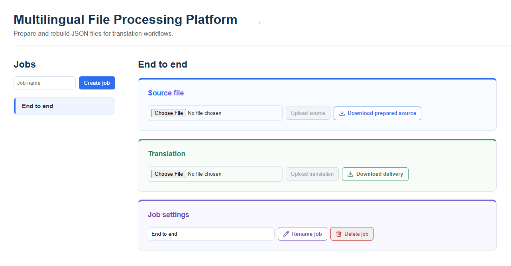
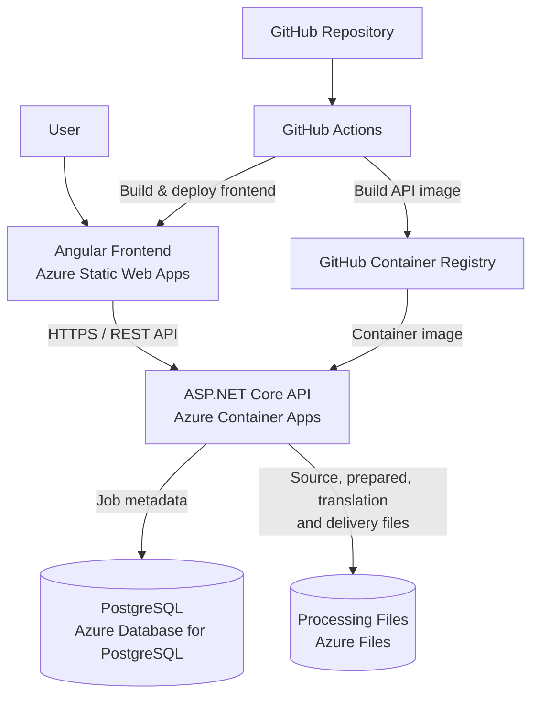

# Multilingual File Processing Platform

A full-stack application for preparing structured content for translation and reconstructing translated files while preserving their original structure.

The project models a simplified localization file-processing workflow. Users create processing jobs, upload JSON source files, extract translatable content into a prepared translation package, upload translated content, validate it, and reconstruct a final translated JSON file.

The application is built with ASP.NET Core, Angular and PostgreSQL, containerised with Docker, and deployed to Microsoft Azure using GitHub Actions.



## How It Works

A source JSON file can contain translatable content nested throughout its structure:

```json
{
  "product": {
    "name": "Wireless Headphones",
    "description": "High-quality wireless headphones with noise cancellation."
  },
  "messages": {
    "addToBasket": "Add to basket",
    "outOfStock": "This product is currently unavailable."
  }
}
```

During preprocessing, translatable strings are extracted into segments:

```json
{
  "segments": [
    {
      "id": "seg-0001",
      "path": "product.name",
      "source": "Wireless Headphones"
    },
    {
      "id": "seg-0002",
      "path": "product.description",
      "source": "High-quality wireless headphones with noise cancellation."
    },
    {
      "id": "seg-0003",
      "path": "messages.addToBasket",
      "source": "Add to basket"
    },
    {
      "id": "seg-0004",
      "path": "messages.outOfStock",
      "source": "This product is currently unavailable."
    }
  ]
}
```

Each segment has a stable ID and records the path of the original value within the source JSON.

After translation, the translated segments can be uploaded back into the application. The application validates the segment IDs and uses the reconstruction data created during preprocessing to rebuild the translated file while preserving the original JSON structure.

The final output retains the structure of the source file with the translated content inserted into the correct locations:

```json
{
  "product": {
    "name": "Casque sans fil",
    "description": "Casque sans fil de haute qualité avec réduction du bruit."
  },
  "messages": {
    "addToBasket": "Ajouter au panier",
    "outOfStock": "Ce produit est actuellement indisponible."
  }
}
```

## Live Demo

The application is deployed to Azure:

[Open the Multilingual File Processing Platform](https://blue-pebble-06ec9e30f.3.azurestaticapps.net)

The API runs on Azure Container Apps using a consumption plan and can scale to zero when inactive. The first request after a period of inactivity may take a few seconds while the API starts.

## Key Features

* Create, rename and delete file-processing jobs.
* Upload JSON source files for processing.
* Extract translatable strings while preserving information required to reconstruct the original JSON structure.
* Generate and download prepared translation files.
* Upload translated content back into the processing workflow.
* Validate translated content for missing, duplicate or unexpected segments.
* Reconstruct and download the final translated JSON file.
* Persist job metadata in PostgreSQL.
* Persist processing files independently of the application container.
* Run the complete application locally with Docker Compose.
* Build and deploy the application using GitHub Actions.

## Architecture



The application is split into a separate Angular frontend and ASP.NET Core backend API.

The frontend is hosted on Azure Static Web Apps and communicates with the API over HTTPS. The API runs as a container in Azure Container Apps and is responsible for job management, file-processing operations, validation, and reconstruction.

Job metadata is stored in Azure Database for PostgreSQL, while uploaded files and generated processing artefacts are stored in Azure Files. Keeping file storage outside the application container means processing data survives container restarts and new revisions.

GitHub Actions is used to build and deploy the frontend and to build and publish the backend container image to GitHub Container Registry. Azure Container Apps then runs that published API image.

## Tech Stack

| Area               | Technology                        |
| ------------------ | --------------------------------- |
| Frontend           | Angular 22, TypeScript, HTML, CSS |
| Backend            | ASP.NET Core Web API, .NET 9, C#  |
| Database           | PostgreSQL, Entity Framework Core |
| File Storage       | Azure Files                       |
| Testing            | xUnit                             |
| Containerisation   | Docker, Docker Compose            |
| Cloud              | Microsoft Azure                   |
| Frontend Hosting   | Azure Static Web Apps             |
| Backend Hosting    | Azure Container Apps              |
| Database Hosting   | Azure Database for PostgreSQL     |
| Container Registry | GitHub Container Registry         |
| CI/CD              | GitHub Actions                    |
| API Communication  | REST, JSON, HTTPS                 |

## Running Locally

The full application can be started locally using Docker Compose.

### Prerequisites

* Docker Desktop

### Start the application

From the repository root, run:

```bash
docker compose up --build
```

This starts:

* Angular frontend: `http://localhost:4200`
* ASP.NET Core API: `http://localhost:8080`
* PostgreSQL database: internal Docker service on port `5432`

The PostgreSQL data is stored in a Docker volume named `postgres-data`, so database data is preserved when the containers are stopped and restarted.

To stop the application, run:

```bash
docker compose down
```

## Deployment and CI/CD

GitHub Actions is used to build and deploy the application from the `main` branch.

Frontend changes trigger a workflow that builds the Angular production application and deploys the generated files to Azure Static Web Apps.

Backend changes trigger a separate workflow that builds the ASP.NET Core Docker image and publishes it to GitHub Container Registry. The Azure Container App runs this published image.

The final backend deployment step is currently manual: after a new image is published, a new Container Apps revision is created to deploy it. Automating this step is planned as a future improvement.

Deployment credentials and environment-specific configuration are stored outside the repository using GitHub secrets and Azure configuration.

## Design Decisions and Trade-offs

### Separate metadata and file storage

PostgreSQL is used for structured job metadata, while processing files are stored separately in Azure Files. This keeps the database focused on queryable application data and allows files to persist independently of the API container.

### Azure Files for persistent processing data

Azure Files was chosen for the deployed application because the existing processing pipeline was already designed around filesystem operations. Mounting persistent storage into the container allowed the application to retain this model without requiring the file-processing layer to be rewritten around object storage such as Azure Blob Storage.

For a larger-scale system, object storage would be worth considering as the processing architecture evolves.

### Consumption-based API hosting

The API uses Azure Container Apps on a consumption plan to keep the running cost of the portfolio project low. This allows the API to scale to zero when unused, with the trade-off that the first request after a period of inactivity can experience a short cold start.

### Deliberately limited v1 scope

The first version focuses on demonstrating the complete processing workflow with JSON files and a single source file per job. Features such as additional file formats, multiple-file jobs, authentication and asynchronous processing were kept out of scope so the initial version could focus on a complete end-to-end workflow.
